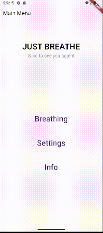
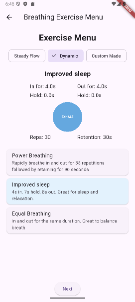
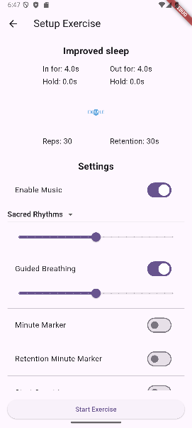

# Just Breathe – Showcase

> A custom breathing exercise app built from scratch using Flutter

---

## Why I'm building this

I was curious to dive deeper into frontend development and understand how to build an actual app from the ground up.
As someone focused on becoming better at fullstack development, I wanted to explore the mobile side of things — including animations, audio handling, state management, and responsive UI.

But more than that, I was tired of switching between multiple apps just to get the breathing exercises I wanted.  
Most existing apps are too rigid. They don't let you **tweak the flow**, **adjust the rhythm**, or **finetune the transitions**.  
We're all different — we have different lungs, different needs, and different definitions of calm.  
So I started developing **Just Breathe** to solve that for myself.

---

## Demo clip



---

## Customize Everything

Choose from built-in breathing modes or create your own:
- Set inhale/hold/exhale durations
- Define number of reps and optional breath retention
- Enable "Sacred Rhythms" (background music)
- Turn on guided voice cues or minute markers

### Menus & Setup

<p align="center">
  
  
</p>

On the left: the **Exercise Menu**, where all breathing exercises are listed.  
Each one is loaded into the animation and previews its flow visually.

On the right: the **Exercise Setup**, where users can toggle background sound,  
guided breathing voice cues, start countdown, and more.

---

##  Under the Hood

Here's a basic example of how the app determines which audio cue to play during a session:

```dart
  // Returns the duration (in seconds) for the current breathing phase, 
  // based on the selected exercise settings.
  double _getDurationForPhase(BreathingPhase phase) {
    final ex = widget.exercise;
    switch (phase) {
      case BreathingPhase.inhale:
        return ex.secIn;
      case BreathingPhase.holdIn:
        return ex.secInHold;
      case BreathingPhase.exhale:
        return ex.secOut;
      case BreathingPhase.holdOut:
        return ex.secOutHold;
    }
  }

  // Plays a guided audio cue for the given phase, 
  // matching the duration to the closest available audio file.
  // If the duration doesn't match exactly, the closest file is used 
  // and playback is trimmed if needed.
  Future<void> _playGuidedSound(String phaseName, double seconds) async {
    if (!ExerciseSetupManager.isGuidedEnabled) return;

    final durations = [2, 4, 6, 8];
    final closest = durations.reduce((a, b) => (a - seconds).abs() < (b - seconds).abs() ? a : b);
    final soundPath = 'sounds/${phaseName}_${closest}s.mp3';

    try {
      await breathAudioPlayer.play(AssetSource(soundPath), volume: ExerciseSetupManager.guidedVolume);
    } catch (e) {
      debugPrint('Failed to play guided sound: $e');
    }
  }
```
---

## Music

The current background music was generated using **Suno** during a paid subscription —  
but future ambient soundscapes (like forest sounds and meditative loops) will be recorded and crafted by me.

[▶️ Listen to a short ambient demo](media/audio/sacred_rhythms_preview.mp3)

## 🗺️ Roadmap & Progress

A quick overview of what’s been built and what’s coming.  
This app isn't just functional – it’s designed with flexibility, modularity and user individuality in mind.

---

### Core Features (Completed)

- [x] **Breathing Animation Circle**  
  Smooth and scalable animation — works in both small and fullscreen formats.
  
- [x] **Built-in Breathing Exercises**  
  Exercises defined as data, not hardcoded. Easy to extend and modify.

- [x] **Dynamic Sound Matching**  
  Guided sounds auto-match phase durations (2–8s) and adjust volume accordingly.

- [x] **Toggleable Features in Setup**  
  - Enable/disable music
  - Guided breathing voice cues
  - Minute markers
  - Retention timers

- [x] **Reusable Settings Components**  
  Sliders, toggles and selectors built for modular use in both preset and future custom flows.

---

### In Progress / Coming Soon

- [ ] **Custom-Made Exercise Builder**  
  Create your own breathing routines. UI is next – backend already supports it.

- [ ] **Loop Options & Repetition Feedback**  
  Show users their progress in real time (e.g. breaths left, animations synced to reps).

- [ ] **Meditation Music Creation & Mastering**  
  Produce additional background tracks tailored for specific moods and flows.
  Polish sound quality with proper mixing and mastering for a smooth audio experience.

- [ ] **Visuals & Theming** 
  Customizable themes & color modes (not just dark mode)

- [ ] **Stats & History Tracking**  
  Log your sessions, time spent, and improvements over time.

---

> All of this is being built modularly. The goal isn’t just “another breathing app” — it’s a flexible breathing platform where the user is in control.